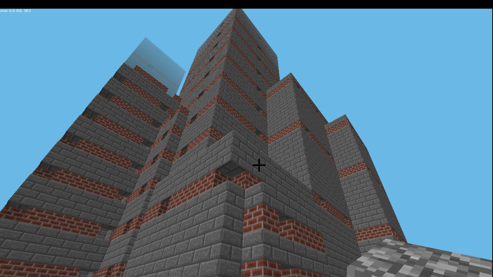
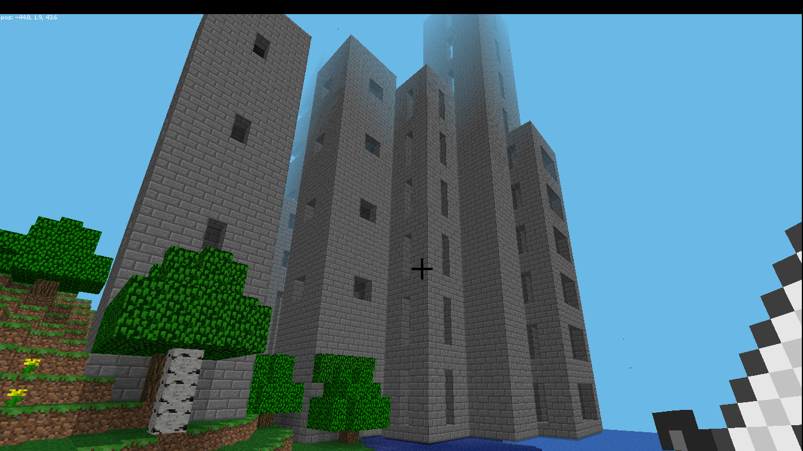

# Minecraft on the Raspberry Pi

my explorations of the python interface to minecraft on the Raspberry Pi, Linux and Mac OSX

Some demos require Martin O'Hanlon's library for drawing shapes: http://www.stuffaboutcode.com/2013/11/coding-shapes-in-minecraft.html

# Demos

## Video Demo

This is [the code](video_demo.py) I used to make the [youtube video demo](https://www.youtube.com/watch?v=m-BHmdWHjeM)

## Spiral Towers

Creates a random collection of buildings, but using much simpler code than my first attempt (towers.py). Also faster and more fun to watch building.

## Towers

Creates a random collection of buildings, code is a bit hard to read. Uses a matrix of values to define the corners of each face of a story. Then towers are made of multiple stories.

# Notes / Links

If you want to run on another platform, see [Martin O'Hanlon's post about CanaryMod](http://www.stuffaboutcode.com/2014/10/minecraft-raspberryjuice-and-canarymod.html). My notes on installing on [OSX are here](OSX_notes.md), which is pretty much identical to Linux (not Pi).

My notes on useful [CanaryMod commands are here](CanaryMod.md)

[Reference for the API](http://www.stuffaboutcode.com/p/minecraft-api-reference.html)

# Thanks

* @martinohanlon for inspiration
* raspberry pi crew
* minecraft crew for making a special version available for the pi!

