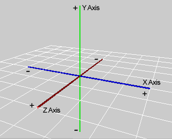
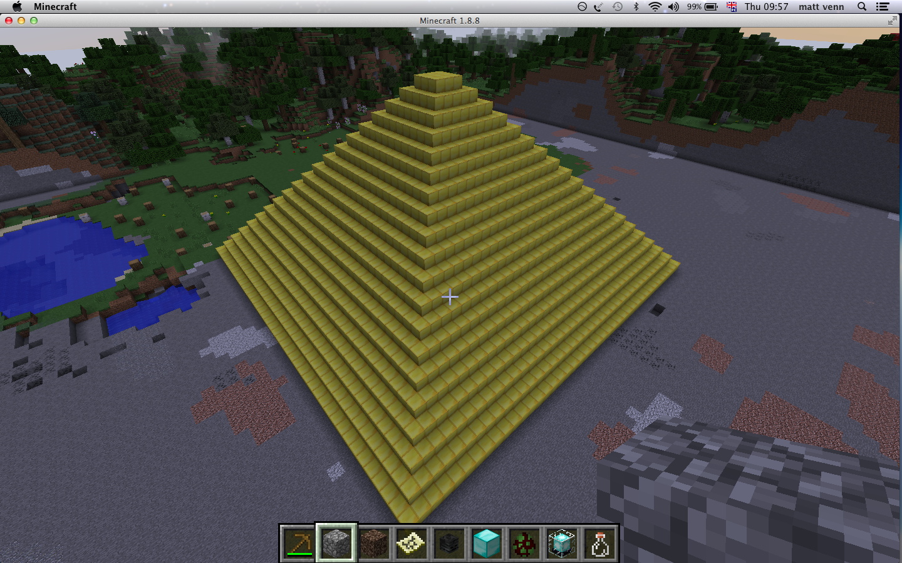

# Big buildings

* KS3
* This activity will help you understand positions in Minecraft and loops
 in Python.
* You will need: Minecraft with the Python API

It's possible to build amazing things in the Minecraft world, and it can often
be a lot quicker with a few Python tricks!

\ 
Image courtesy of [crpeh](https://www.reddit.com/r/Minecraft/comments/14i1lu/we_are_ready_for_liftoff_captain/)

## Single blocks

It's easy to create a single block in the Minecraft world. First of all, import
the Minecraft libraries:

    import mcpi.minecraft as minecraft
    import mcpi.block as block

Then create a `handle` that will let you interface Python with Minecraft:

    mc = minecraft.Minecraft.create()

Then to place a block, use the `setBlock` code:

    mc.setBlock(x, y, z, block_id)

X, Y and Z are the co-ordinates where the block is placed:

\ 

And the `block_id` is either the number of the block you want to place, or its
name. Both these commands make a gold block:

    mc.setBlock(x, y, z, 41)
    mc.setBlock(x, y, z, block.GOLD_BLOCK.id)

\ 

If you want to place a block where you currently are, you can look at the top left of the screen, where your X, Y and Z position is displayed.

## Bigger blocks

Placing one block at a time is great, but there is also a way to creat big volumes of blocks by asking Minecraft to fill in all the space in between 2 co-ordinates:

    setBlocks(x1, y1, z1, x2, y2, z2, block_id)

The volume between x1, y1, z1 and x2, y2, z2 will be filled with blocks of type
`block_id`. 

\ 

For more information about `setBlocks`, see [this page](https://arghbox.wordpress.com/2013/07/07/minecraft-pi-api-setting-blocks/) by [Craig
Richardson](https://twitter.com/CraigArgh)

An easy way to clear a big space to start building, is to use `setBlocks` to fill a volume with air blocks:

    mc.setBlocks(-10,0,-10,10,10,10,block.AIR.id)

So when you clear the area with the command above, the volume is
from x = -10 to x = 10, y = 0 to y = 10, and z = -10 to z = 10. 

## Tower blocks

\ 

Try using your `setBlocks` skills to build a few big tower blocks.

## Pyramids

Try building a pyramid by stacking 5 squares on top of each other, with each square a bit smaller than the last:

    mc.setBlocks(-5,0,-5,5,1,5,block.GOLD_BLOCK.id)
    mc.setBlocks(-4,1,-4,4,2,4,block.GOLD_BLOCK.id)
    ...

Can you see a pattern in the X, Y and Z numbers? Because there is a simple
pattern, you can save time, or build bigger pyramids by using a loop:

~~~ { .python }
width = 5
height = 0

while width > 0:
    width = width - 1
    height = height + 1
    print(width, height)
~~~

Try using a loop to build a huge pyramid!

\ 
