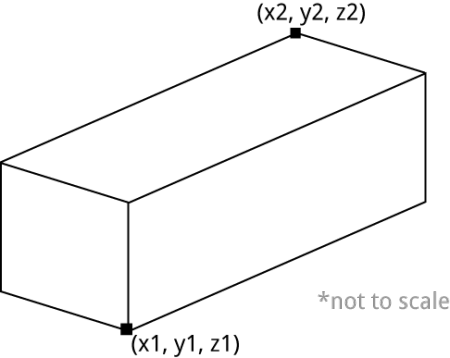

# Big buildings

* This activity will help you understand positions in Minecraft,
* How to define volumes in 3D space
* Loops in Python,

It's possible to build amazing things in the Minecraft world, and it can often
be a lot quicker with a few Python tricks!

\ 
Image courtesy of [crpeh](https://www.reddit.com/r/Minecraft/comments/14i1lu/we_are_ready_for_liftoff_captain/)

## Bigger blocks

You've already seen how to build single blocks at a time with the `setBlock`
function. 

Placing one block at a time is great, but there's also a way to creat big volumes of blocks by asking Minecraft to fill in all the space in between 2 co-ordinates:

\ 

The volume between x1, y1, z1 and x2, y2, z2 will be filled with blocks of type
`block_id`. Here's what the code would look like for the picture above:

    setBlocks(x1, y1, z1, x2, y2, z2, block_id)

Note that `x1`, `y1`, `z1`, `x2`, `y2` and `z2` are just telling you what
parameters are needed and how they work. You'd need to put real numbers in to
make it work.

To use a real example, let's say you want to make a cube 20 blocks wide,
with the center at x=0, y=0, z=0. The code would be:

    gold = 41
    setBlocks(-10, -10, -10, 10, 10, 10, gold)

An easy way to clear a big space ready to start building is to use `setBlocks` to fill a volume with air blocks:

    air = 0
    mc.setBlocks(-60, 0, -60, 60, 60, 60, air)

This command would remove a large cuboid, 120 blocks deep by 120 blocks wide and 60 blocks tall.

## Tower blocks

Try using `setBlocks` to build a few big blocks.

\ 

If you use a loop, you could build a tower block with each story built of a
different kind of block:

~~~ { .python }
story = 0
block_id = 10
# a 10 story building
while story < 10:
    mc.setBlocks(-5, story, -5, 5, story, 5, block_id)
    story = story + 1
    block_id = block_id + 1
~~~

## Pyramids

Try building a pyramid by stacking 5 squares on top of each other, with each square a bit smaller than the last:

    gold = 41
    mc.setBlocks(-5,0,-5,5,0,5,gold)
    mc.setBlocks(-4,1,-4,4,1,4,gold)
    mc.setBlocks(-3,2,-3,3,2,3,gold)
    ...

Complete the pattern and test your code, does it make a pyramid?

Now you'll use a loop to build a gigantic pyramid without having to do lots of
repetitive typing.

There are 3 patterns in the numbers. Remember the definition of the `setBlocks`
commmand:

    setBlocks(x1, y1, z1, x2, y2, z2, block_id)

* `x1` and `z1` are the same, starting at -5 and increasing by 1 each time,
* `x2` and `z2` are the same, starting at 5 and decreasing by 1 each time,
* `y1` and `y2` are the same, starting at 0 and increasing by 1 each time.

Try running this program - does it create the right numbers?

~~~ { .python }
width = 5
height = 0

while width > 0:
    print(-width, height, width)
    height = height + 1
    width = width - 1
~~~

Can you add an extra line that uses `setBlocks` to create a pyramid?

\ 
