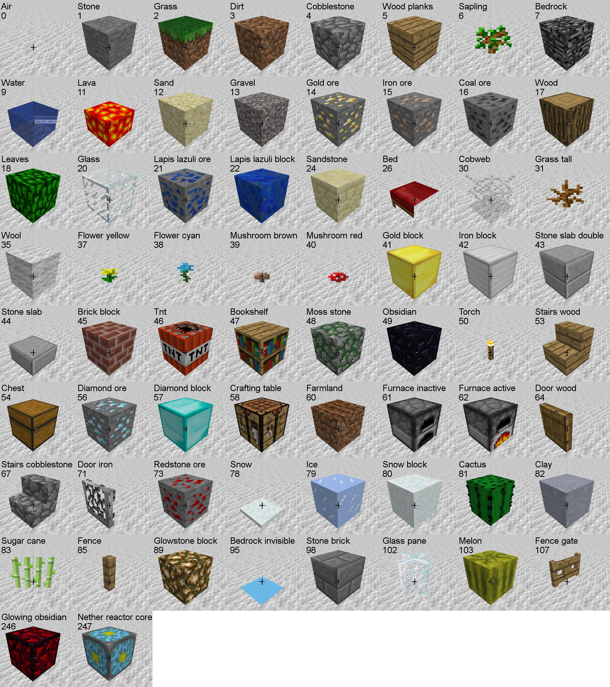
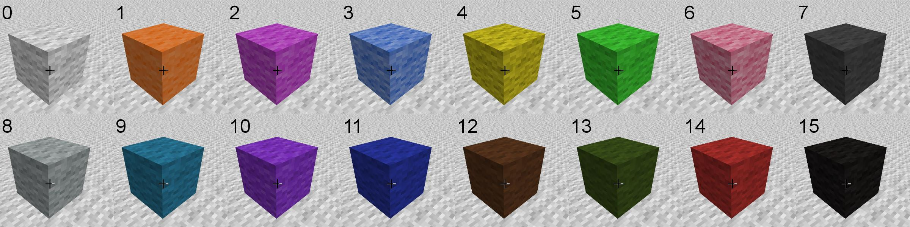

# block type images

for the CPD4T workshop handout

## create screenshots of each block

* get player in a good position for viewing,
* make full screen
* run [all_blocks.py](all_blocks.py)

There are 2 sections in `all_blocks.py`, one for the blocks, then another for the different wool colours. Pick between them with comments.

## montage

run [montage.py](montage.py) to stitch together all the images.
