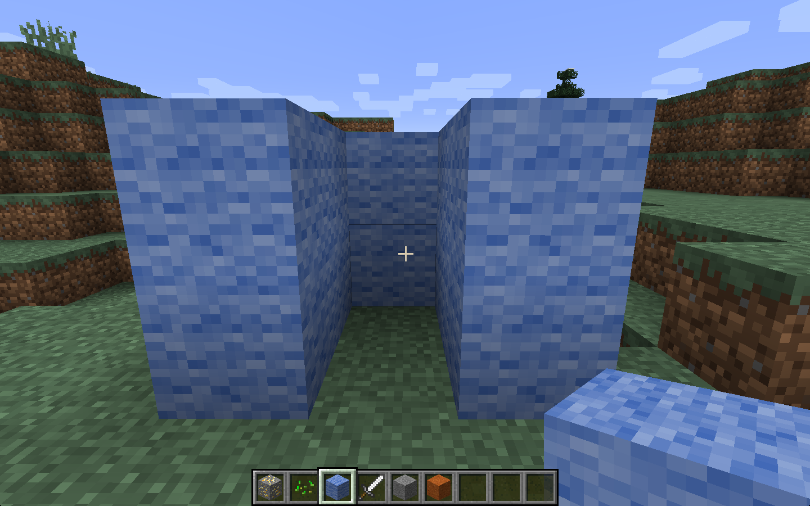

# Photo booth

* This activity will help you understand positions in Minecraft,
* Conditional statements in Python,
* How to use a camera with Python,
* You will need: Minecraft with the Python API, USB webcam or a PiCamera.

You will build a photo booth, then create a program that takes a photo when you
step inside. Its just like the trap activity, but it takes a photo instead of
trapping you.

## Building the booth

Use your building skills to construct a 3 walled cubicle like the picture below:

## Positions

Start your program with the usual lines:

~~~ { .python }
import mcpi.minecraft as minecraft
import mcpi.block as block

mc = minecraft.Minecraft.create()
~~~

Now add the following code to print out your location:

~~~ { .python }
while True:
	x, y, z = mc.player.getTilePos()
    print(x, y, z)
~~~

Run the program and walk around. You should see your position in x, y, z
co-ordinates being printed in the Python Shell.

Walk to your booth and make a note of the co-ordinates when you are inside.

## Conditionals

Now you need a `conditional statement` so that something happens only when
you're in the exact location you just found:

~~~ { .python }
if x == -247 and y == 10 and z == 60:
    print("say cheese!")
~~~

Put this code into your loop (make sure the code is indented properly) and run
your program again. This time, when you walk into the booth the program should
print out 'say cheese!'.

Now change your program so instead of printing a message it takes a photo of you using a web cam.

## Webcam

You'll be using a USB webcam. Some software called `fswebcam` has already been
installed for you.

Try this Python code to take a photo:

~~~ { .python }
filename = 'image.jpg'
import os
# os.system() runs a linux command. fswebcam is a program that can take photos
os.system("fswebcam  --no-banner -r 800x600 -d /dev/video0 " + filename)
~~~
