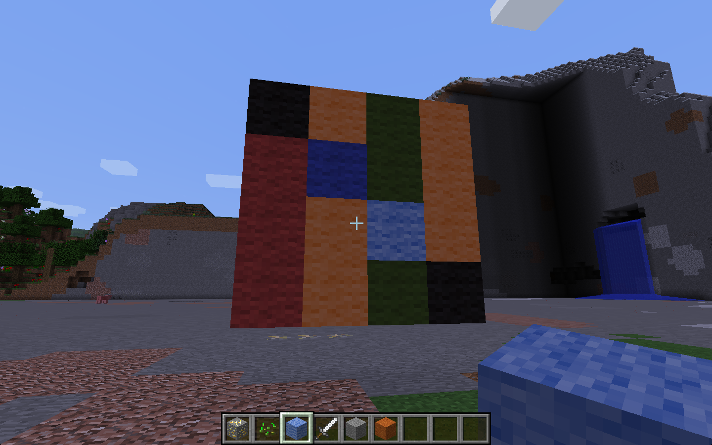
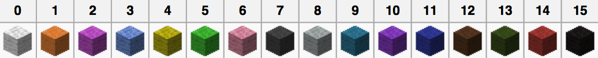

% KS3
% programming, loops, Python, Minecraft
%

# Pixel Art

* KS3
* This activity will help you understand datastructures and lists in Python
* You will need: Minecraft with the Python API

You will draw a simple pattern on graph paper, and then write a program to
reproduce this in Minecraft.

----

## Draw your art

Get some graph paper or draw a grid on some plain paper. Use different colours
in each block to build a simple image. Keep your image smaller than 8 x 8
blocks.

Then make a copy of your image, but convert the colours to numbers using this
table:

## Lists

Now convert your picture into a Python data structure - each row is going to
become a list, and all the lists that represent rows will be put into another
list that represents the whole picture.

This is the data structure used to create the picture above:

    pixels = [
        [ 15, 13, 1, 14 ],
        [ 1, 3, 1, 14 ],
        [ 1, 13, 11, 14 ],
        [ 1, 13, 1, 15 ],
        ]

You can test this works by iterating through the data structure. Iterating means
stepping through it. In this case you'll be using a `for loop` because it does
something for each item in the list.

~~~ { .python }
for row in pixels:
    print("new row:")
    for pixel in row:
        print(pixel)
~~~

When you run the program you should see each value in the pixel data structure
printed out.

Now change your program so that instead of printing out numbers in the shell,
it creates the right coloured blocks in Minecraft.

To start with you'll need the usual stuff at the top of the program:

~~~ { .python }
import mcpi.minecraft as minecraft
import mcpi.block as block

mc = minecraft.Minecraft.create()
~~~

Then add the `for loop` above, modifying it so that the blocks get created in
the right places. 
