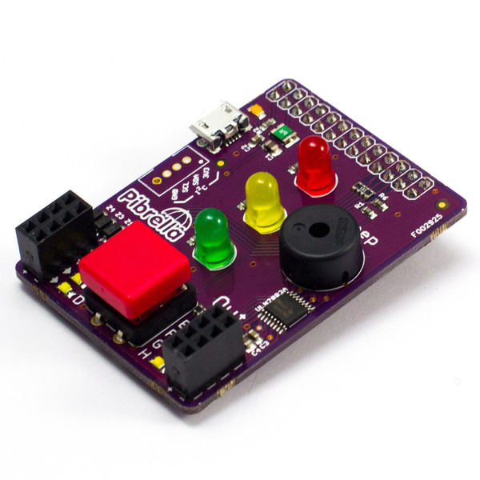

% KS3
% programming, pibrella, loops, Python, Minecraft
%

# Teleport

* KS3
* This activity will help you understand how to use a Pibrella with Minecraft
* You will need: Minecraft with the Python API, PiBrella add on board

You will use the PiBrella's button to teleport Steve to a random location in
Minecraft.

----

## Button

Try this program to check the PiBrella is working:

~~~ { .python }
import pibrella

while True:
	if pibrella.button.read() == 1:
        print("button pressed!")
~~~

Afer saving the program, you'll have to run it using the `sudo` command because
accessing the Raspberry Pi's GPIOs needs super user privileges. If your program
is called teleport.py, open a terminal, change to the directory where your
program is and type:

    sudo python teleport.py

## Random numbers

To go to a random location you can make use of the `random` library.
Try running this program a few times:

~~~ { .python }
import random
x = random.randint(-100, 100)
print(x)
~~~

The `randint(min, max)` function takes 2 parameters that set the range of the random number it returns.

Modify the button test program above so that 3 new random numbers are printed
every time the button is pressed. 

## Teleport

Teleporting in Minecraft is as easy as setting the player position:

~~~ { .python }
import mcpi.minecraft as minecraft
import mcpi.block as block

mc = minecraft.Minecraft.create()
mc.player.setPos(100, 100, 100)
~~~

Modify your program so that pressing the button teleports Steve to a random new
location.
