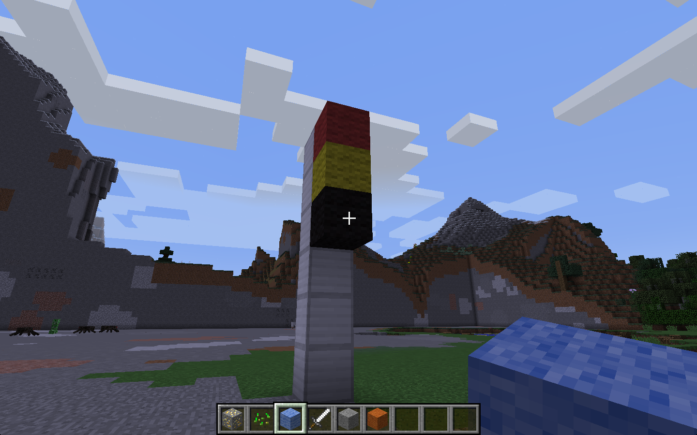
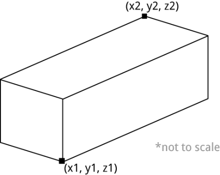

% KS3
% programming, loops, Python, Minecraft
%

# Traffic lights

* KS3
* This activity will help you understand loops using Python.
* You will need: Minecraft with the Python API

You will create traffic lights in Minecraft and animate them with a loop.

----

## Creating blocks

You need the usual libraries at the start of your program:

~~~ { .python }
import mcpi.minecraft as minecraft
import mcpi.block as block

mc = minecraft.Minecraft.create()
~~~

Then clear a space and send Steve there:

~~~ { .python }
# clear area
mc.setBlocks(-60,0,-60,60,50,60,block.AIR.id)

# go there
mc.player.setPos(5,0,0)
~~~

Take a look at the `setBlocks` command above. There are quite a lot of
parameters!

Here it is again with names for each parameter:

    setBlocks(x1, y1, z1, x2, y2, z2, blockID)

The volume between x1, y1, z1 and x2, y2, z2 will be filled with blocks of type
blockID. 

So when you clear the area with the command above, the volume is
from x = -60 to x = 60, y = 0 to y = 50, and z = -60 to z = 60.

For more information about `setBlocks`, see [this page](https://arghbox.wordpress.com/2013/07/07/minecraft-pi-api-setting-blocks/) by [Craig
Richardson](https://twitter.com/CraigArgh)

Either use a few `setBlock` commands or a single `setBlocks` command to create a
traffic light.

## Coloured wool blocks

Then create the 3 lights with a wool block set to black:

    mc.setBlock(x, y, z, block.WOOL.id, 15)

In this case, you pass an extra parameter (15) to setBlock which sets the wool
block to be black. Here are the colours you need:

* black = 15
* red = 14
* amber = 4
* green = 13

## Loops

To create an animation of the lights changing you'll use an infinite loop.
Here's an example that flashes a block between black and red:

~~~ { .python }
import time
while True:

    # make block red
    mc.setBlock(x, y, z, block.WOOL.id, 14)
    # wait for 1 second
    time.sleep(1)

    # make block black
    mc.setBlock(x, y, z, block.WOOL.id, 15)
    # wait for 1 second
    time.sleep(1)
~~~

Now extend the loop to animate the whole traffic light sequence.
