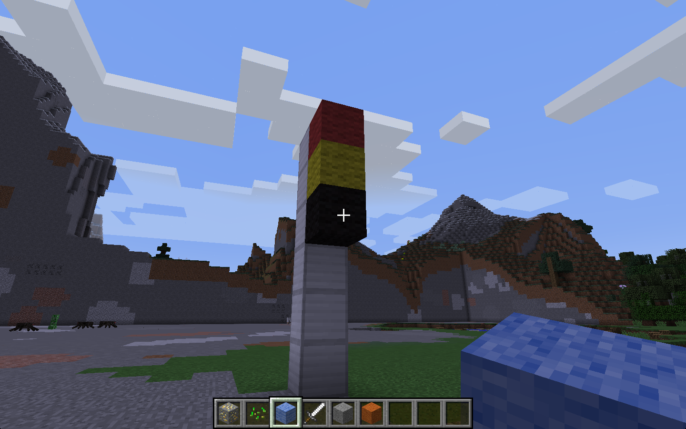

# Traffic lights

* This activity will help you understand loops using Python,
* Creating different coloured blocks,
* You will need: Minecraft with the Python API.

You will create traffic lights in Minecraft and animate them with a loop.

## Creating blocks

You need to import the Minecraft library and setup the `handle`:

~~~ { .python }
import mcpi.minecraft as minecraft
import mcpi.block as block

mc = minecraft.Minecraft.create()
~~~

Then clear a space and send your player there:

~~~ { .python }
# clear area
mc.setBlocks(-60,0,-60,60,50,60,block.AIR.id)

# go there
mc.player.setPos(5,0,0)
~~~

Now use a few `setBlock` commands to create a traffic light like the one in the
picture.

## Coloured wool blocks

To change colours of blocks in Minecraft, you can use the `WOOL` block. It's a
special block that can be set to 16 different colours:

\ 

Here's how you could create a black `WOOL` block at the 0, 0, 0 position.

    mc.setBlock(0, 0, 0, block.WOOL.id, 15)

In this case, you pass an extra parameter (15) to setBlock which sets the wool
block to be black. 

## Loops

To create an animation of the lights changing you'll use an infinite loop.
Here's an example that flashes a block between black and red:

~~~ { .python }
import time
while True:

    # make block red
    mc.setBlock(0, 0, 0, block.WOOL.id, 14)
    # wait for 1 second
    time.sleep(1)

    # make block black
    mc.setBlock(0, 0, 0, block.WOOL.id, 15)
    # wait for 1 second
    time.sleep(1)
~~~

Now extend the loop to animate the whole traffic light sequence.
