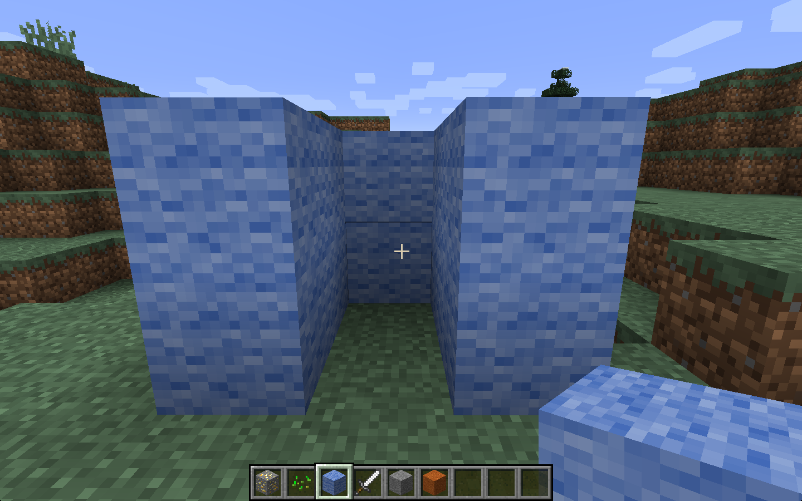

# Trap!

* KS3
* This activity will help you understand positions in Minecraft and conditional
 statements in Python.
* You will need: Minecraft with the Python API

You will build a trap, then create a program that builds a wall the instant you
step inside.

## Building a trap

This time, you'll use Steve's building skills to construct a 3 walled cubicle
like the picture below:

## Positions

You need to include the usual libraries at the start of your program:

~~~ { .python }
import mcpi.minecraft as minecraft
import mcpi.block as block

mc = minecraft.Minecraft.create()
~~~

Now add the following code to print out Steve's location:

~~~ { .python }
while True:
	playpos = mc.player.getTilePos()
    print(playpos)
~~~

Run the program and walk around. You should see your position in x, y, z
co-ordinates being printed in the Python Shell.

Walk to your trap and make a note of the co-ordinates when you are inside.

## Conditionals

Now you need a `conditional statement` so that something happens only when Steve
is in the exact location you just found:

~~~ { .python }
if playpos.x == -247 and playpos.y == 10 and playpos.z == 60:
    print("trapped!")
~~~

Put this code into your loop (make sure the code is indented properly) and run
your program again. This time, when you walk into the trap the program should
print out 'trapped!'.

Now change your program so instead of printing a message it builds a wall behind
you after you've walked in - preventing you from walking out.

You can use the `setBlock` command to achieve this:

~~~ { .python }
    mc.setBlock(x, y, z, block_id)
~~~
