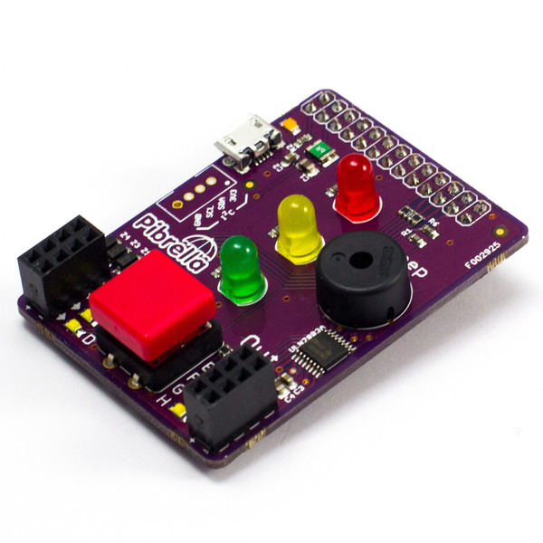

# Treasure Hunt

* This activity will help you understand how to use a Pibrella with Minecraft
* The Vec3 position object
* Pythagoras theorum in 3D

You will use the PiBrella's lights to guide you to hidden treasure in Minecraft.

\ 

## Lights

Type this program into a new file and save it as `treasure.py`:

~~~ { .python }
import pibrella
pibrella.light.on()
~~~

Afer saving the program, you'll have to run it using the `sudo` command because
accessing the Raspberry Pi's GPIOs needs super user privileges. 

Start a terminal by double clicking the `LXTerminal` icon on the desktop.
Then in the black terminal window type:

    sudo python treasure.py

Which should turn all the PiBrella's lights on.

## Calculating distance in Minecraft

In previous exercises, you've used `mc.player.getTilePos()` to find your
position. This function returns a type of object called `Vec3`. In the past
you've accessed the x, y and z co-ordinates like this:

	if playpos.x == -247 and playpos.y == 10 and playpos.z ==60:
        # do something

This time you'll use another `Vec3` object to help calculate the distance
between you and the treasure. Add this to your program:

~~~ { .python }
from mcpi.vec3 import Vec3
# hide the treasure
destination = Vec3(100, 5, 20)
~~~

The `destination` variable is a `Vec3` object, and you can subtract different
`Vec3` objects to find the difference between them.

Add this to your program:

~~~ { .python }
import mcpi.minecraft as minecraft
mc = minecraft.Minecraft.create()

playpos = mc.player.getTilePos()
diff = playpos - destination
print(diff.x, diff.y, diff.z)
~~~

You should see the x, y and z distance between your current position and the
treasure.

## Pythagoras

In the 2 dimensional world, you'll have come across Pythagoras' theorum. There
is something very similar for the 3D world of Minecraft:

    from math import sqrt
	dist = sqrt(diff.x * diff.x + diff.y * diff.y + diff.z * diff.z)

## Flashy lights

If you put your code in a loop, then as you move around in Minecraft, the
distance will be constantly recalculated.

How can you make the lights flash faster the smaller `dist` is? Here's some code
that turns a light on and off at a set frequency:

~~~ { .python }
import pibrella
import time

while True:
    pibrella.light.red.on()             # turn on the red LED
    time.sleep(0.1)
    pibrella.light.red.off()            # turn off the red LED
    time.sleep(0.1)
~~~
