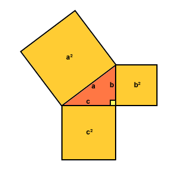

# Treasure Hunt - Pibrella

* This activity will help you understand how to use a Pibrella with Minecraft
* The Vec3 position object
* Pythagoras theorum in 3D

You will use the PiBrella's lights to guide you to hidden treasure in Minecraft.

\ 

## Lights

Type this program into a new file and save it as `treasure.py`:

~~~ { .python }
import pibrella, time
pibrella.light.on()
time.sleep(1)
~~~

Afer saving the program, you'll have to run it using the `sudo` command because
accessing the Raspberry Pi's GPIOs needs super user privileges. 

Start a terminal by double clicking the `LXTerminal` icon on the desktop.
Then in the black terminal window type:

    sudo python3 treasure.py

Which should turn all the PiBrella's lights on.

## Calculating distance in Minecraft

In previous exercises, you've used `mc.player.getTilePos()` to find your
position. In the past you've accessed the x, y and z co-ordinates like this:

    x, y, z = mc.player.getTilePos()
	if x == -247 and y == 10 and z ==60:
        # do something

To get the distance between you and the treasure, you'll first need to 'hide'
the treasure by creating some variables to store its location:

~~~ { .python }
# hide the treasure
treas_x = 100
treas_y = 5
treas_z = 20
~~~

Now you can subtract your position from the treasure position to find the
distances:

~~~ { .python }
import mcpi.minecraft as minecraft
mc = minecraft.Minecraft.create()

while True:
    x, y, z = mc.player.getTilePos()
    dist_x = x - treas_x
    dist_y = y - treas_y
    dist_z = z - treas_z
    print(dist_x, dist_y, dist_z)
~~~

You should see the x, y and z distance between your current position and the
treasure.

## Pythagoras

In the 2 dimensional world, you'll have come across Pythagoras' theorum. There
is something very similar for the 3D world of Minecraft:

    from math import sqrt
	dist = sqrt(dist_x * dist_x + dist_y * dist_y + dist_z * dist_z)

## Flashy lights

If you put your code in a loop, then as you move around in Minecraft, the
distance will be constantly recalculated.

How can you make the lights flash faster the smaller `dist` is? Here's some code
that turns a light on and off at a set frequency:

~~~ { .python }
import pibrella
import time

while True:
    pibrella.light.red.on()             # turn on the red LED
    time.sleep(0.1)
    pibrella.light.red.off()            # turn off the red LED
    time.sleep(0.1)
~~~
